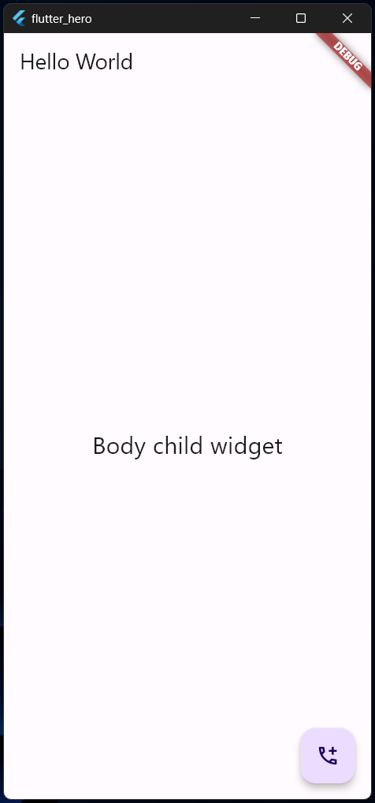

# flutter_hero

A new Flutter project by following a 5 day youtube video live.

## Day 1: Introduction to Flutter and Getting Started

### Module 1: Introduction to Flutter

- Overview of Flutter
- What is Dart?
- Why Flutter is popular in mobile app development
- Real-life examples of Flutter apps

### Module 2: Setting Up the Development Environment

- Installing Flutter and Dart
- Configuring Flutter SDK
- Setting up Android Studio or VS Code for Flutter development
- Running a simple "Hello World" app

### Module 3: Understanding Widgets

- Introduction to widgets

